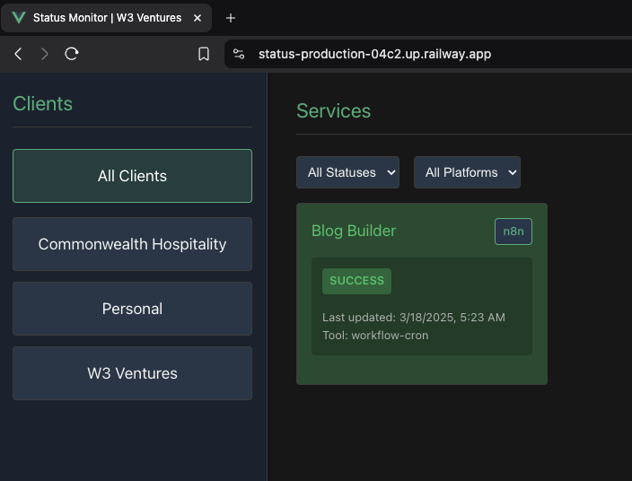

# Status Dashboard
A unified dashboard for real-time monitoring of workflows and services

# Parts
- Server to consume status updates
- Cron Services to update status regularly
- Dashboard to display real-time status

# Tech Stack
- Python (Scripting + FastAPI)
- VueJs
- Supabase
- Cron
- Railway

